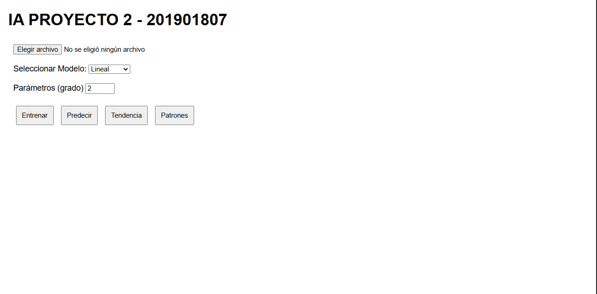
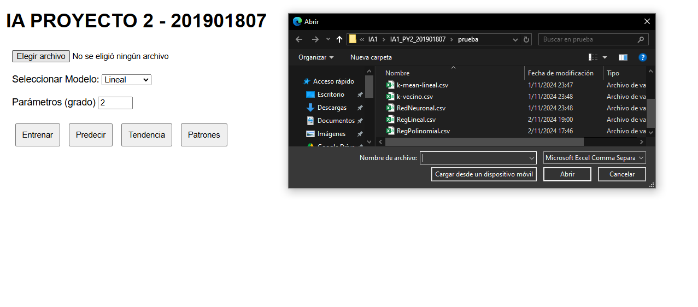
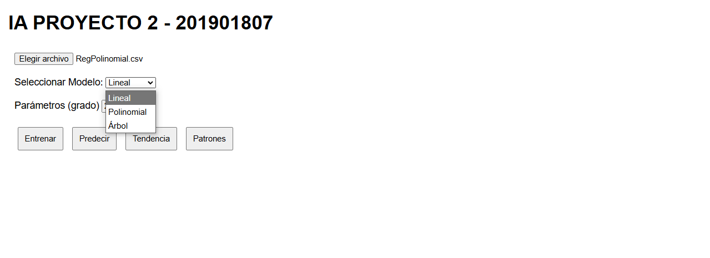
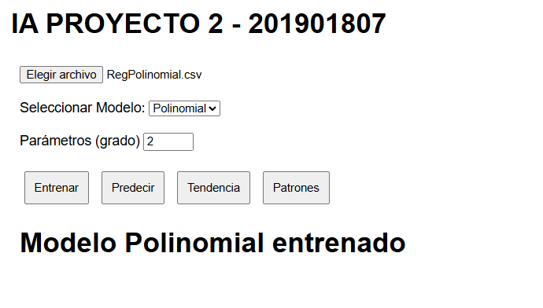
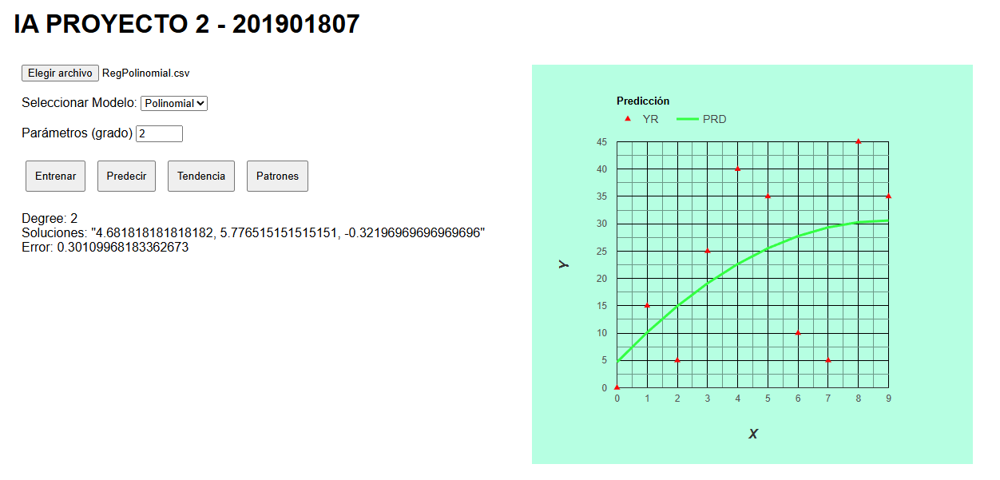
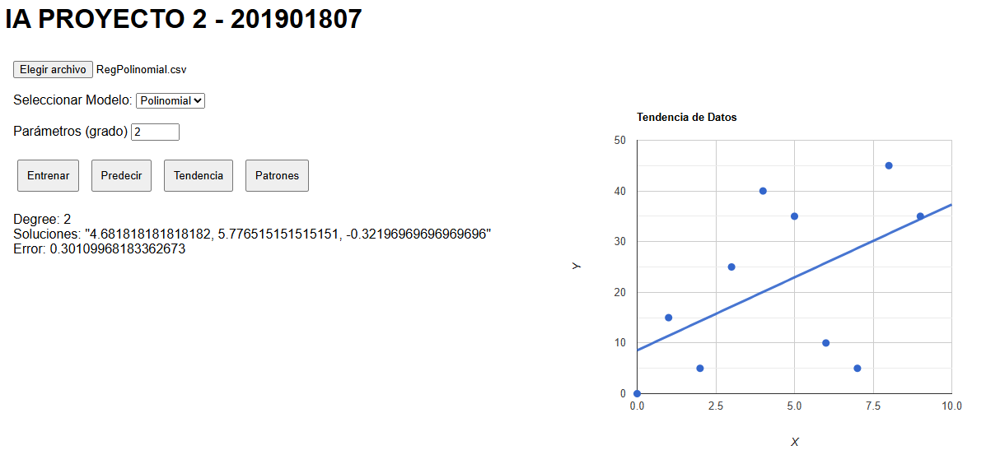
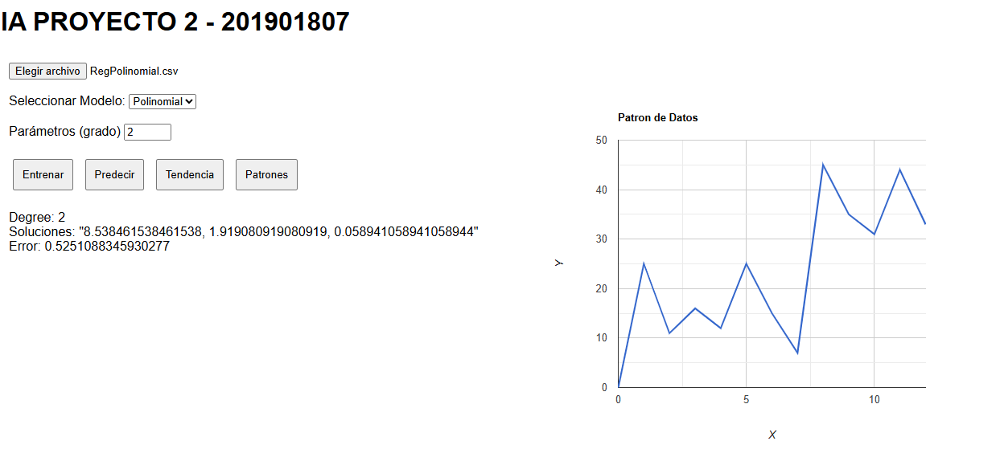

# Manual de Usuario
## Oward Sian - 201901807
### Objetivo
- Brindar una guía detallada para la utilización del sitio web para que las personas que deseen utilizarlo lo usen de la manera correcta y evitar que tengan confusiones al momento de la ejecusión del mismo.
- Guía clara para el uso de los modelos predictivos.

### Guía para la utilización del sitio web
1. Pantalla principal del programa: La pantalla principal del sitio web sirve como punto de inicio para la interacción con la aplicación. En ella, el usuario encontrará un encabezado claro con el título del proyecto, seguido de una interfaz amigable. La pantalla se divide en secciones que guían al usuario en el flujo de trabajo, desde la carga de archivos hasta la visualización de resultados. Esta interfaz tiene un diseño intuitivo, lo que facilita el acceso a cada una de las funcionalidades disponibles en el programa.

2. Selección de archivo a cargar: Esta sección permite al usuario cargar un archivo CSV con los datos que se analizarán y procesarán. El botón de carga de archivos está diseñado para aceptar únicamente archivos con extensión .csv, garantizando que los datos cargados sean compatibles con el sistema. Una vez seleccionado el archivo, el contenido se procesa y se prepara para el análisis. La carga de datos es el primer paso esencial para iniciar cualquier tipo de procesamiento o entrenamiento de modelos en la aplicación.

3. Selección del modelo a utilizar: En esta parte, el usuario puede escoger entre diferentes modelos de Machine Learning disponibles. El menú desplegable facilita la selección entre modelos como regresión lineal, regresión polinomial y modelos basados en árboles de decisión. Esta opción permite al usuario adaptar el análisis de acuerdo con sus necesidades específicas y el tipo de datos que posee. Es importante seleccionar el modelo que mejor se alinee con el objetivo de análisis para obtener resultados precisos.

4. Ingreso de parámetros para el modelo: Esta sección permite al usuario especificar los parámetros necesarios para configurar el modelo elegido. Por ejemplo, en un modelo de regresión polinomial, se puede ingresar el grado del polinomio. La parametrización es clave para ajustar el modelo al tipo de análisis que se desea realizar y optimizar su rendimiento. El usuario debe ingresar estos valores en el campo correspondiente antes de proceder al entrenamiento del modelo.

5. Entrenamiento del Modelo: Después de cargar los datos y seleccionar el modelo, el usuario puede entrenar el modelo haciendo clic en el botón de entrenamiento. Esta acción ejecuta el proceso de entrenamiento, donde el modelo analiza los datos y ajusta sus parámetros internos para aprender patrones y relaciones en el conjunto de datos. El entrenamiento puede llevar un tiempo dependiendo de la complejidad del modelo y el tamaño del dataset. Al finalizar, se notificará al usuario que el modelo ha sido entrenado correctamente.

6. Predicción del Modelo seleccionado: Una vez que el modelo ha sido entrenado, el usuario puede usarlo para hacer predicciones sobre nuevos datos. Esta funcionalidad es útil para evaluar el comportamiento del modelo y su capacidad de generalización. El usuario puede ingresar valores de entrada específicos y el sistema mostrará los resultados de la predicción. Esta etapa es esencial para validar el modelo y verificar si cumple con las expectativas de precisión y relevancia.

7. Muestra de la tendencia que poseen los datos: Esta sección permite al usuario visualizar la tendencia general de los datos mediante gráficos. Los gráficos de tendencias ayudan a entender cómo se comportan los datos a lo largo del tiempo o en relación con ciertas variables. Esta funcionalidad es útil para identificar patrones de crecimiento o declive y evaluar cómo estos patrones afectan los resultados del modelo. La visualización de la tendencia proporciona un contexto visual que puede complementar el análisis numérico.

8. Muestra de los patrones que poseen los datos: En esta parte, la aplicación muestra patrones y relaciones dentro de los datos, como agrupamientos o correlaciones. Esto se realiza mediante gráficos avanzados que destacan aspectos importantes del conjunto de datos. La visualización de patrones permite al usuario explorar los datos en profundidad y detectar características relevantes que pueden influir en los resultados. Esta función es especialmente útil para análisis exploratorios y para comprender mejor el comportamiento de los datos.

