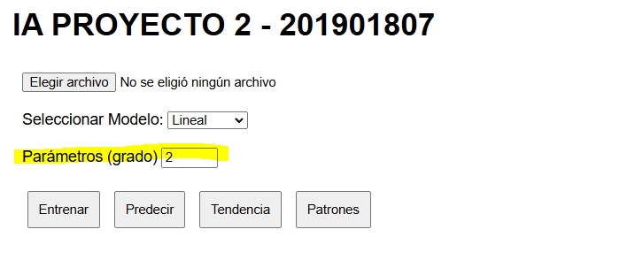

# Manual de Usuario
## Oward Sian - 201901807
### Objetivo
- Brindar una guía detallada para la utilización del sitio web para que las personas que deseen utilizarlo lo usen de la manera correcta y evitar que tengan confusiones al momento de la ejecusión del mismo.
- Guía clara para el uso de los modelos predictivos.

### Guía para la utilización del sitio web
1. Pantalla principal del programa

2. Seleccion de archivo a cargar

3. Seleccion del modelo a utilizar

4. Ingreso de parametros para el modelo

5. Entrenamiento del Modelo

6. Predicción del Modelo seleccionado

7. Muestra de la tendencia que poseen los datos.

8. Muestra de los patrones que poseen los datos.

